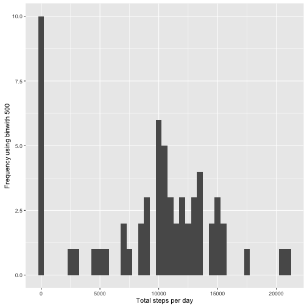
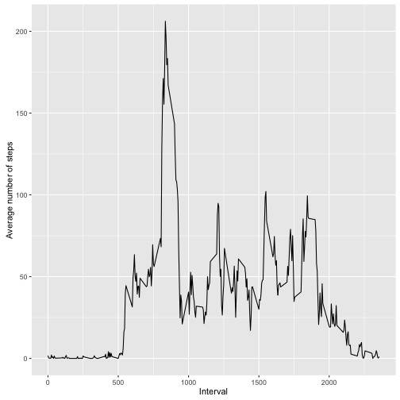
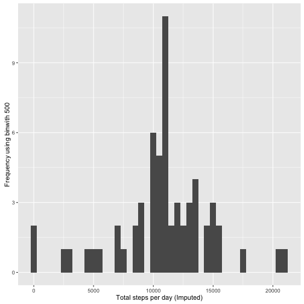
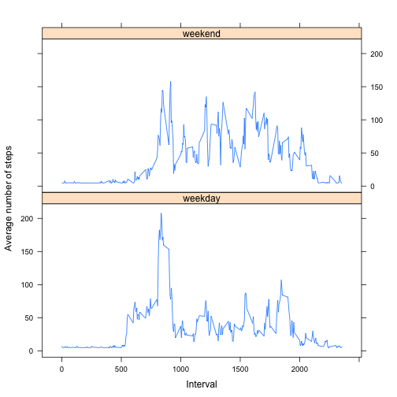

```r
knitr::opts_chunk$set(echo = TRUE)
```

```r
library(Hmisc)
```

## Loading and Pre-processing data
### Read the csv file

```r
setwd("~/Documents/Sri/Courses/Data Science/Rdata")
actdata <- read.csv("activity.csv", header = TRUE)
```

## What is the mean total number of steps taken per day
### 1.Calculate the total number of steps taken per day

```r
totstepsbyday <- tapply(actdata$steps,actdata$date, sum, na.rm = TRUE)
```

### 2.Make a histogram of the total number of steps per day

```r
qplot(totstepsbyday, xlab='Total steps per day', ylab='Frequency using binwith 500', binwidth=500)
```



### 3.Calculate and report the mean and median of the total number of steps per day

```r
meansteps <- mean(totstepsbyday)
mediansteps <- median(totstepsbyday)
```
#### Mean total number of steps per day : 9354.2295082
#### Median total number of steps per day : 10395

## What is the average daily activity pattern?
### 1. Make a time series plot of the 5 min interval (x axis) and the average number of steps taken, averaged across all days (y axis)

```r
avgsteps <- aggregate(x= list(meansteps = actdata$steps), by = list(interval = actdata$interval), FUN = mean, na.rm = TRUE)
ggplot(avgsteps,aes(x=interval, y = meansteps)) + geom_line() + xlab("Interval") + ylab("Average number of steps")  
```


    
### 2. Which 5 min interval has the maximum number of steps on average

```r
maxsteps <- which.max(avgsteps$meansteps)
timemaxsteps <-  gsub("([0-9]{1,2})([0-9]{2})", "\\1:\\2", avgsteps[maxsteps,'interval'])
```

#### Maximum number of steps at : 8:35

## Imputing missing values
### 1.Calculate and report the total number of missing values in the dataset (i.e. the total number of missing values)

```r
nummissingvalues <- length(which(is.na(actdata$steps)))
```
#### Number of missing values : 2304

### 2.Devise a strategy for filling in all of the missing values in the dataset.
### 3.Create a new dataset that is equal to the original dataset but with the missing data filled in. 

```r
actdataimputed <- actdata
actdataimputed$steps <- impute(actdata$steps,fun = mean)
```
### 4.Make a histogram of the total number of steps taken each day and calculate and report the mean median total number of steps per day. 

```r
totstepsbydayimputed <- tapply(actdataimputed$steps,actdataimputed$date, sum, na.rm = TRUE)
qplot(totstepsbydayimputed, xlab='Total steps per day (Imputed)', ylab='Frequency using binwith 500', binwidth=500)
```



### 4.Calculate and report the mean and median of the total number of steps taken per day. Do these values differ from the estimates from the first part of the assignment?

```r
meanimputed <- mean(totstepsbydayimputed)
medianimputed <- median(totstepsbydayimputed)
```
#### Mean total number of steps per day (Imputed) : 1.0766189 &times; 10<sup>4</sup>
#### Median total number of steps per day (Imputed) : 1.0766189 &times; 10<sup>4</sup>

#### The estimate of the total number of steps has increased due to the imputing.

## Are there differences in activity patterns between weekdays and weekends?
### 1.Create a new factor variable in the dataset with two levels ??? ???weekday??? and ???weekend??? indicating whether a given date is a weekday or weekend

```r
actdataimputed$day <- ifelse(as.POSIXlt(actdataimputed$date)$wday %in% c(0,6),"weekend", "weekday")
```
### 2.Make a panel plot containing a time series plot of the interval (x axis) and the avg number of steps (y axis) averaged across all weekdays and weekends.???erval

```r
avgbyday <- aggregate(steps ~ interval + day, data = actdataimputed, FUN = mean)
xyplot(avgbyday$steps ~ avgbyday$interval | avgbyday$day, layout = c(1,2), type = "l", xlab = "Interval", ylab = "Average number of steps")
```



